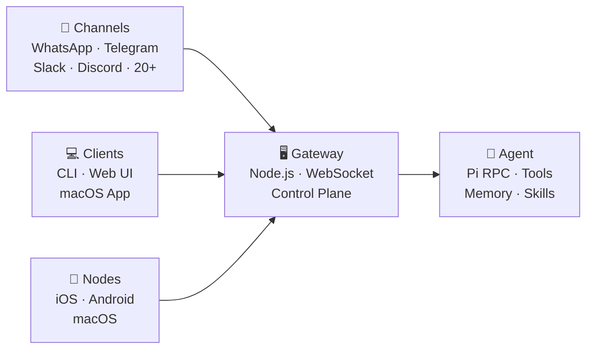
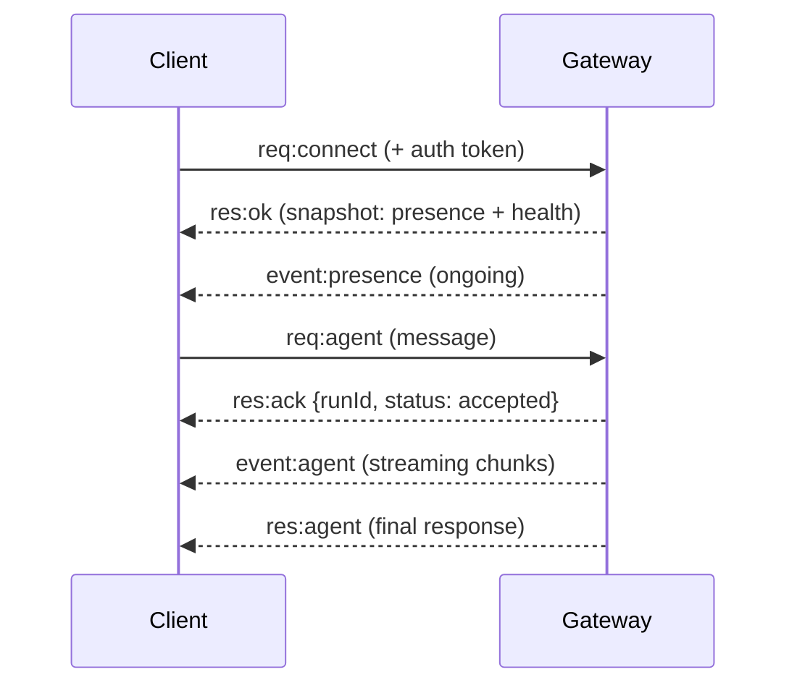
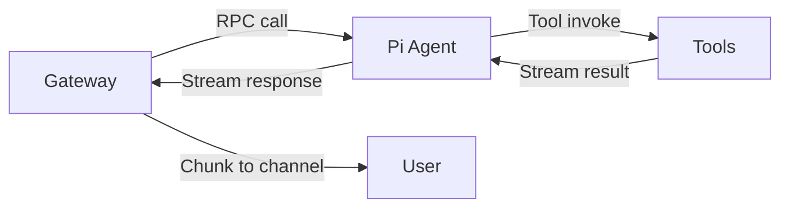
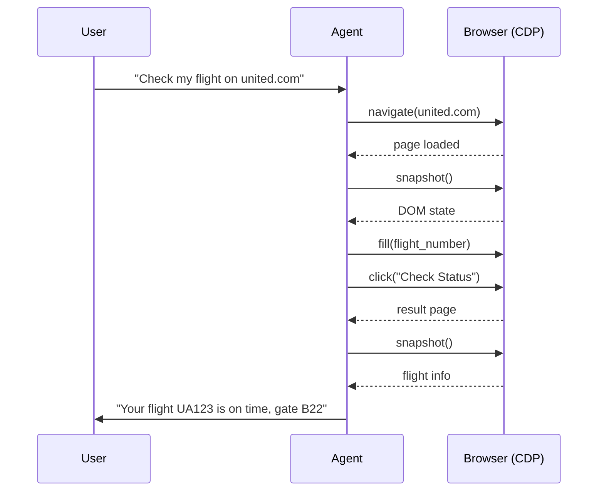

# OpenClaw

## Technical Deep Dive

**For Engineering & Technical Teams**

---
transition: fade-out
---

# Agenda

<v-clicks>

1. ⚡ **Quick Recap** — What OpenClaw is (10 min)
2. 🏗️ **Architecture** — Gateway, protocol, channels (15 min)
3. 🧠 **Agent Runtime** — Sessions, memory, multi-agent (10 min)
4. 🔧 **Tools & Skills** — Extensibility model (10 min)
5. 🚀 **Deployment & Ops** — Install, config, security (10 min)
6. 💬 **Q&A** (5 min)

</v-clicks>

---
layout: section
---

# ⚡ Quick Recap
## What OpenClaw Is

---

# OpenClaw in 60 Seconds

<div class="text-xl mt-4 mb-8">

> Self-hosted AI assistant gateway. 20+ messaging channels. Actually does things.

</div>

<v-clicks>

- 🏠 **Self-hosted** — your hardware, your data
- 💬 **Multi-channel** — WhatsApp, Telegram, Slack, Discord, Teams, iMessage...
- 🧠 **Persistent memory** — file-based, human-readable
- 🔧 **Tool-using agent** — browser, shell, files, devices
- 🤖 **Multi-agent** — isolated brains with their own workspaces
- 📖 **MIT licensed**, 500+ contributors, active development

</v-clicks>

---
layout: section
---

# 🏗️ Architecture Deep Dive

---

# High-Level Architecture



---

# Gateway Internals

<div class="grid grid-cols-2 gap-6">
<div>

### What It Owns
- All messaging connections
- WebSocket server (control plane)
- Session lifecycle
- Tool dispatch & streaming
- Cron/webhook automation
- Canvas host (A2UI)
- HTTP dashboard

</div>
<div>

### Design Choices
- **One process** — no microservices
- **One WS port** — all clients connect here
- **Stateless adapters** — state in session store
- **JSON Schema** validation on wire
- **Idempotency keys** for safe retries

</div>
</div>

<v-click>

<div class="mt-4 p-3 bg-yellow-500 bg-opacity-10 rounded text-sm">

💡 Key insight: one Gateway per host. It's the only place that opens a WhatsApp session, manages Telegram polling, etc.

</div>

</v-click>

---

# Wire Protocol

```json
// Request
{"type": "req", "id": "abc123", "method": "agent", "params": {...}}

// Response
{"type": "res", "id": "abc123", "ok": true, "payload": {...}}

// Server-push event
{"type": "event", "event": "agent", "payload": {...}, "seq": 42}
```

**Connection lifecycle:**



---

# Channel Adapters

| Channel | Library | Auth |
|---------|---------|------|
| WhatsApp | Baileys (Web) | QR link device |
| Telegram | grammY | Bot token |
| Discord | discord.js | Bot token |
| Slack | Bolt (Socket Mode) | Bot + App tokens |
| Signal | signal-cli | Daemon |
| iMessage | BlueBubbles | Server URL + password |
| MS Teams | Bot Framework | Azure registration |
| Feishu | Plugin | Event subscription |
| Matrix, LINE, IRC, Mattermost... | Various | Per-channel config |

<v-click>

<div class="mt-2 p-2 bg-blue-500 bg-opacity-10 rounded text-sm">

Channels are **stateless adapters**. All state lives in the Gateway's session store. Adding a new channel = implementing the adapter interface.

</div>

</v-click>

---

# Nodes — Device Integration

Nodes connect as WS clients with `role: node`:

```json
{
  "role": "node",
  "deviceId": "iphone-15-pro",
  "caps": ["canvas", "camera", "screen", "location"],
  "commands": ["canvas.*", "camera.*", "screen.record", "location.get"]
}
```

<div class="grid grid-cols-2 gap-6 mt-4">
<div>

### Capabilities
- `system.run` — local commands
- `system.notify` — push notifications
- `camera.snap/clip` — photo/video
- `screen.record` — screen capture
- `location.get` — GPS
- `canvas.*` — agent-driven UI

</div>
<div>

### Pairing Flow
1. Node connects with device ID
2. Gateway issues challenge
3. User approves (CLI/app)
4. Device token for future connects
5. Loopback = auto-approve

</div>
</div>

---
layout: section
---

# 🧠 Agent Runtime
## Sessions, Memory, Multi-Agent

---

# Pi Agent (RPC Mode)



<v-clicks>

- Pi runs as **RPC subprocess** — Gateway sends messages, Pi returns actions
- **Tool streaming** — Pi invokes tools (browser, exec, files) mid-response
- **Block streaming** — responses stream in real-time to channels
- **Context engine** — manages conversation window, triggers compaction

</v-clicks>

---

# Session Model

<div class="grid grid-cols-2 gap-6">
<div>

### Session Types
- **main** — direct chats (shared)
- **group** — isolated per group
- **sub-agent** — spawned for tasks
- **ACP** — external coding agents

### Scoping
- `per-peer` — each sender isolated
- `shared` — all DMs share one session

### Key Format
```
agent:<agentId>:<mainKey>
```

</div>
<div>

### Context Lifecycle
1. Messages accumulate in context
2. Context approaches model window
3. **Compaction** triggers
4. History summarized, key facts kept
5. Critical AGENTS.md re-injected
6. Session continues seamlessly

### Plugin Interface
```typescript
interface ContextEngine {
  bootstrap()
  ingest()
  assemble()
  compact()
  afterTurn()
}
```

</div>
</div>

---

# File-Based Memory

```
~/.openclaw/workspace/
├── AGENTS.md       ← Agent instructions
├── SOUL.md         ← Personality/identity
├── USER.md         ← Info about the human
├── TOOLS.md        ← Local tool notes
├── MEMORY.md       ← Long-term memory (curated)
├── HEARTBEAT.md    ← Periodic task checklist
├── memory/
│   ├── 2026-03-12.md    ← Daily logs
│   └── heartbeat-state.json
└── skills/
    └── weather/
        └── SKILL.md
```

<v-click>

<div class="mt-4 p-3 bg-green-500 bg-opacity-10 rounded">

**No vector database.** Human-readable markdown. Version-controllable with git. The "soul document" concept: `SOUL.md` defines AI identity.

</div>

</v-click>

---

# Multi-Agent Routing

```json
{
  "agents": {
    "list": [
      {"agentId": "main", "workspace": "~/.openclaw/workspace"},
      {"agentId": "work", "workspace": "~/.openclaw/workspace-work"}
    ],
    "bindings": [
      {"channel": "slack", "agentId": "work"},
      {"channel": "telegram", "agentId": "main"}
    ]
  }
}
```

<v-clicks>

Each agent has its own:
- 📁 **Workspace** — files, memory, personality
- 🔐 **Auth profiles** — model credentials
- 💾 **Session store** — chat history
- 🛠️ **Skills** — tool capabilities
- 🧠 **Identity** — completely independent brain

</v-clicks>

---
layout: section
---

# 🔧 Tools & Skills
## Extensibility Model

---

# Built-in Tools

| Tool | Description |
|------|-------------|
| `exec` | Shell commands (with approval) |
| `read/write/edit` | File operations |
| `browser` | CDP Chrome/Chromium control |
| `canvas` | Agent-driven UI (A2UI) |
| `nodes` | Device control |
| `cron` | Scheduled tasks |
| `web_search` | Web search (Brave, Perplexity, etc.) |
| `web_fetch` | Fetch & extract web content |
| `sessions_*` | Multi-agent coordination |
| `message` | Cross-channel messaging |
| `tts` | Text-to-speech |
| `image` / `pdf` | Vision analysis |

---

# Browser Control — How It Works



<v-click>

**No API needed.** Controls websites exactly like a human would.

</v-click>

---

# Skills System

```
skills/weather/
├── SKILL.md          ← Instructions + metadata
└── scripts/
    └── fetch-weather.sh
```

```yaml
# SKILL.md frontmatter
---
name: weather
description: Get weather forecasts
version: 1.0.0
tools: [exec, web_fetch]
---
```

**Precedence:** workspace > managed > bundled

**ClawHub** — community marketplace: `clawhub install <skill-slug>`

---

# Automation: Cron + Webhooks

<div class="grid grid-cols-2 gap-6">
<div>

### Cron Jobs
```json
{
  "schedule": "0 9 * * 1-5",
  "agentId": "main",
  "message": "Morning briefing",
  "announce": {
    "telegram": "<your_chat_id>"
  }
}
```

### Heartbeats
- Periodic agent polling (~30 min)
- Checks HEARTBEAT.md for tasks
- Rotates through: email, calendar, weather

</div>
<div>

### Webhooks
- HTTP endpoints → agent sessions
- Gmail Pub/Sub integration
- Custom event handlers

### Plugin Hooks
- `before_agent_start`
- `session:compact:before/after`
- Context engine plugins
- Channel plugins

</div>
</div>

---
layout: section
---

# 🚀 Deployment & Ops

---

# Deployment Options

| Option | Best For | Complexity |
|--------|----------|------------|
| **Local laptop** (npm) | Personal use, dev | ⭐ |
| **Linux VPS** (Docker) | Always-on, remote | ⭐⭐ |
| **Raspberry Pi** | Low-cost always-on | ⭐⭐ |
| **macOS mini** | Power users | ⭐ |
| **Cloud VM** (EC2, GCP) | Enterprise / team | ⭐⭐⭐ |

```bash
# Install
npm install -g openclaw@latest

# Guided setup
openclaw onboard --install-daemon

# Start
openclaw gateway --port 18789
```

---

# Model Provider Flexibility

| Provider | Example Models | Auth |
|----------|---------------|------|
| **Anthropic** | Claude 4.x | API key / OAuth |
| **OpenAI** | GPT-5.x, Codex | API key / OAuth |
| **Google** | Gemini | API key |
| **Amazon Bedrock** | All Bedrock models | IAM |
| **OpenRouter** | 100+ models | API key |
| **Azure OpenAI** | Azure models | Azure creds |
| **Local** | Ollama, vLLM | Local endpoint |

<v-click>

```json5
{
  agent: {
    model: "anthropic/claude-opus-4-6",
    fallbackModels: ["openrouter/auto", "openai/gpt-5.2"]
  }
}
```

</v-click>

---

# Security Model

<div class="grid grid-cols-2 gap-6">
<div>

### Access Control
- 🔑 Token auth for Gateway
- 👋 DM pairing for unknown senders
- 📋 Channel & sender allowlists
- 🏷️ Inbound = untrusted input

### Sandboxing
```json5
{
  agents: {
    defaults: {
      sandbox: {
        mode: "non-main"
      }
    }
  }
}
```

</div>
<div>

### Remote Access
- **Tailscale Serve** — tailnet HTTPS
- **Tailscale Funnel** — public (password required)
- **SSH tunnels** — headless servers
- **Cloudflare Tunnel** — alternative

### Operations
```bash
openclaw doctor    # Config health
openclaw status    # Gateway status
openclaw backup create  # Backup
openclaw update    # Auto-update
```

</div>
</div>

---

# Source Code Layout

```
openclaw/                          # v2026.3.8
├── dist/              # Compiled output
├── docs/              # Documentation (Mintlify)
├── extensions/        # Channel plugins
├── skills/            # Bundled skills
├── assets/            # Static assets
├── openclaw.mjs       # Entry point
├── package.json
└── CHANGELOG.md

# Key details:
# - TypeScript codebase → dist/
# - pnpm for builds
# - Gateway = main process (daemon via launchd/systemd)
# - Pi = RPC subprocess
# - All tools typed with JSON Schema
```

---

# Key Technical Differentiators

<v-clicks>

1. 🏗️ **Gateway-First** — single process, all channels converge, no sync issues
2. 📝 **File-Based Memory** — no vector DB, human-readable, git-friendly
3. 🧩 **Skill Extensibility** — directories with SKILL.md, hot-reloadable
4. 🔀 **Provider Agnostic** — any model, failover chains, cloud + local
5. 🔒 **Security by Default** — DM pairing, sandboxing, per-session restrictions

</v-clicks>

---
layout: center
class: text-center
---

# Thank You! 🦞

<div class="text-xl mt-4">

**OpenClaw — Technical Deep Dive**

</div>

<div class="mt-8 grid grid-cols-4 gap-4 text-sm">

[💻 Source](https://github.com/openclaw/openclaw) | [📖 Docs](https://docs.openclaw.ai) | [🏗️ Architecture](https://docs.openclaw.ai/concepts/architecture) | [🎯 ClawHub](https://clawhub.com)

</div>

<div class="mt-8">

Questions?

</div>
