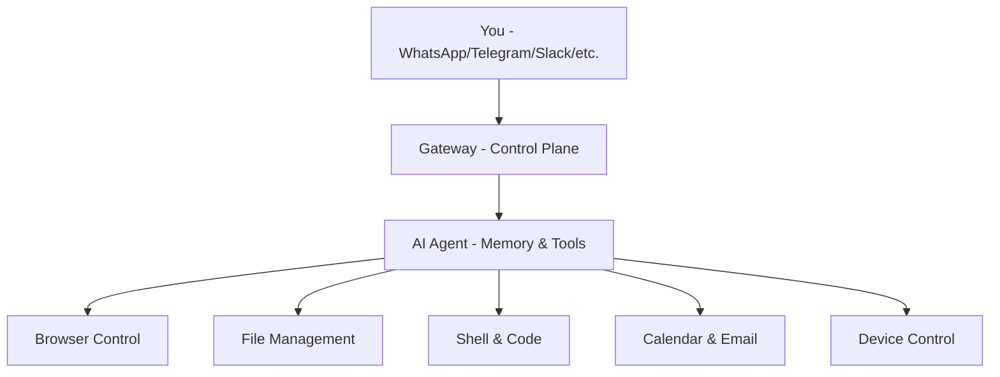

# OpenClaw

## Your AI That Actually Does Things

  
    For Product Managers, Business Teams & Decision Makers
  

  <a href="https://github.com/openclaw/openclaw" target="_blank" alt="GitHub" title="OpenClaw on GitHub"
    class="text-xl slidev-icon-btn opacity-50 !border-none !hover:text-white">
    <carbon-logo-github />
  </a>

---
transition: fade-out
---

# Agenda

<v-clicks>

1. 🤔 **The Problem** — Why current AI falls short
2. 🦞 **Enter OpenClaw** — What it is & how it works
3. 🚀 **Key Capabilities** — Real-world use cases
4. 🎬 **Showcase** — Community highlights
5. 💰 **Business Value** — Why it matters
6. 💬 **Q&A**

</v-clicks>

---
layout: section
---

# 🤔 The Problem
## Why Current AI Falls Short

---

# The "Last Mile" Problem

AI is incredibly smart, but lives in a browser tab.

<v-clicks>

| AI Can... | But Can't... |
|-----------|-------------|
| Write an email draft | **Send it** |
| Plan your day | **Check your calendar** |
| Write code | **Deploy it** |
| Analyze data | **Fetch it automatically** |

</v-clicks>

<v-click>

> "I want to message my AI like a coworker, and have it **do** things for me."

</v-click>

---

# The Fragmented Tooling Problem

### Today's Reality
- 🖥️ Cursor/Copilot for code
- 💬 ChatGPT for chat
- ✍️ Jasper for writing
- 📅 Various for scheduling
- 🔀 None of them talk to each other
- 🧠 **None of them know YOU**

### What We Want
- ☝️ **One AI** that does everything
- 🔗 Connected to all your tools
- 💭 Remembers your context
- 📱 Available on every platform
- 🤖 Proactive, not just reactive

---
layout: section
---

# 🦞 Enter OpenClaw
## Your AI That Actually Does Things

---

# What is OpenClaw?

> A **self-hosted personal AI assistant** that lives on your devices and reaches you through the apps you already use.

<v-clicks>

- 🏠 **Self-hosted** — runs on YOUR hardware, your data stays yours
- 💬 **Multi-channel** — WhatsApp, Telegram, Slack, Discord, iMessage, Teams... 20+ platforms
- 🧠 **Memory & continuity** — remembers everything across sessions
- 🔧 **Actually does things** — browser control, file management, email, devices
- 🤖 **Multi-agent** — multiple isolated AI brains in one deployment
- 📖 **Open source** — MIT licensed, 500+ contributors

</v-clicks>

---

# How It Works

<v-click>

Instead of going **to** AI, AI comes **to you** — on the apps you already use.

</v-click>

---

# The Key Differentiators

### Traditional AI
- Lives in a browser tab
- No memory between sessions
- Can only talk
- Cloud-only, vendor-controlled
- One interface
- Siloed capabilities
- Locked to one model

### OpenClaw
- **Lives in YOUR messaging apps**
- **Persistent memory & personality**
- **Can actually DO things**
- **Self-hosted, you own it**
- **20+ channels simultaneously**
- **Extensible skill system**
- **Any model provider**

---
layout: section
---

# 🚀 Key Capabilities
## Real-World Use Cases

---

# 🛒 Shopping & Daily Life

**Tesco Grocery Autopilot** (Real community project)

<v-clicks>

1. User messages: *"Do weekly shop"*
2. OpenClaw opens Tesco website via browser control
3. Adds regular items from memory
4. Picks delivery slot
5. Confirms order
6. **No API needed — just browser automation**

</v-clicks>

<v-click>

💡 This pattern works for ANY website — booking flights, managing accounts, filling forms...

</v-click>

---

# 💼 Developer & Business Workflows

### Code Review via Chat
- AI reviews Pull Requests automatically
- Sends feedback to Telegram/Slack
- Can fix issues & open new PRs
- Works with GitHub, GitLab, etc.

### Project Management
- Jira/Linear/Todoist integration
- Create & update tasks from chat
- Status reports on demand
- Sprint summaries

### Automation Examples
- Morning briefings with email + calendar
- Expense report processing
- Document generation
- Data pipeline monitoring

---

# 🏠 Smart Home & Health

### IoT Control
- 🌬️ Air purifier management
- 🖨️ 3D printer control (Bambu)
- 📷 Camera monitoring
- 🏠 Smart home automation

### Health & Wellness
- ⌚ Oura Ring data analysis
- 💪 WHOOP metrics & summaries
- 📊 Health trend tracking
- 🏃 Fitness optimization

### Mobile-First
- 📱 iOS/Android companion apps
- 🎤 Voice wake: *"Hey OpenClaw"*
- 🗣️ Talk Mode for voice interaction
- 📸 Camera & screen access
- 📍 Location-aware actions

---

# 🧠 The Memory System

What makes OpenClaw truly personal:

<v-clicks>

- **Daily conversation logs** — raw notes of what happened
- **Long-term memory** — curated insights, preferences, lessons
- **Personality (SOUL.md)** — your AI develops its own identity
- **User profile** — learns about you over time
- **Skills memory** — learns new capabilities and remembers how to use them

</v-clicks>

<v-click>

🧠 It's like having an assistant that **never forgets** and **keeps getting better**.

</v-click>

---
layout: section
---

# 🎬 Community Showcase

---

# What People Are Building

🛒 **Tesco Shop Autopilot** — Weekly groceries via browser

🍷 **Wine Cellar Manager** — 962 bottles tracked

📱 **iOS App via Telegram** — Built & deployed to TestFlight

📊 **TradingView Analysis** — Chart screenshots + TA

🏥 **Oura Health Assistant** — Ring data + calendar

✈️ **Flight Booking** — Multi-provider search CLI

🖨️ **3D Printer Control** — Bambu Lab management

🚇 **Vienna Transport** — Real-time departures

📧 **Accounting Intake** — Auto PDF collection

🎾 **Padel Court Booking** — Never miss a slot

👨‍💻 **14+ Agent Orchestra** — Opus orchestrator + Codex workers

💼 **Slack Auto-Support** — Company channel bot

---

# What Users Say

> *"After years of AI hype, I thought nothing could faze me. Then I installed OpenClaw."*
> — @lycfyi

> *"It's running my company."*
> — @therno

> *"This is the first time I have felt like I am living in the future since the launch of ChatGPT."*
> — @davemorin

> *"Me 30 mins later: controlling Gmail, Calendar, WordPress from Telegram like a boss."*
> — @Abhay08

> *"Took literally 5 mins to set everything up."*
> — @sharoni_k

> *"The fact that it's self-hackable will make sure tech like this DOMINATES conventional SaaS."*
> — @rovensky

---
layout: section
---

# 💰 Business Value
## Why It Matters

---

# ROI at Every Level

### 👤 Individual
- Save **1-2 hours/day**
- Always-on assistant
- One AI, all platforms
- Personal knowledge base

### 👥 Team
- Multi-agent routing
- Isolated workspaces
- Shared skill library
- Consistent tooling

### 🏢 Enterprise
- **Self-hosted = compliance**
- **Open source = no lock-in**
- Plugin ecosystem
- **Any model provider**

<v-click>

| Metric | Value |
|--------|-------|
| Messaging channels | **20+** |
| Community contributors | **500+** |
| Release cadence | **Multiple per week** |
| License | **MIT** |

</v-click>

---
layout: center
class: text-center
---

# Thank You! 🦞

**OpenClaw — Your AI That Actually Does Things**

[🌐 Website](https://openclaw.ai) | [📖 Docs](https://docs.openclaw.ai) | [💻 GitHub](https://github.com/openclaw/openclaw) | [🎯 ClawHub](https://clawhub.com)

Questions?

